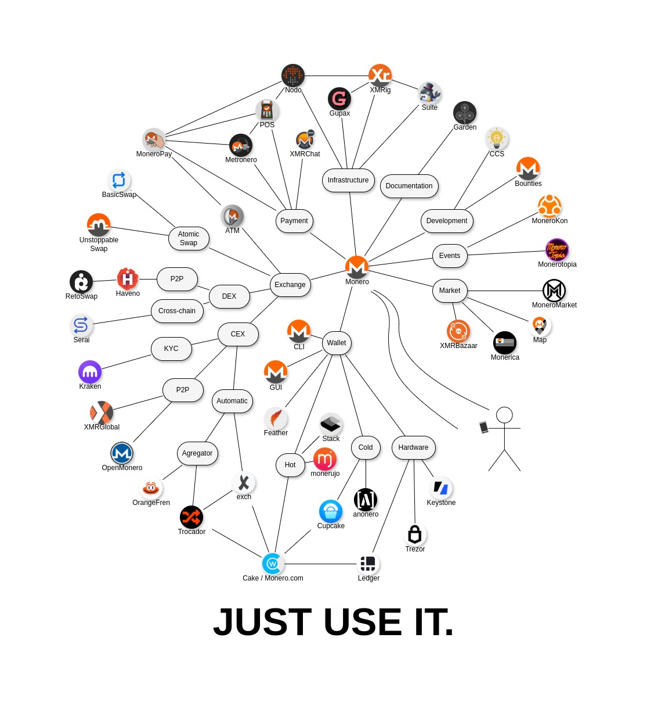

# Monero Ecosystem

The Ecosystem of Monero - [Demo](https://schmidt1024.github.io/monero-ecosystem/monero-ecosystem-map-drawio.html)

This idea comes to us from mondetta. So special thanks to him for bringing this up! 🙏🏻

## How to Contribute

We welcome contributions to the Monero Ecosystem project! Here are a few ways you can get involved:

1. **Modify the Diagram**:
   - Download the `.drawio` file from the repository.
   - Go to [draw.io](https://app.diagrams.net/).
   - Open the existing diagram by uploading the `.drawio` file.
   - Make your changes and save the updated file.
   - Create a pull request with your changes.

2. **Submit Ideas or Comments**:
   - If you have suggestions or ideas but do not want to make changes yourself, you can add a comment or idea in the Issues section of the repository.
   - Navigate to the Issues tab and create a new issue with your suggestion or feedback.

We appreciate your contributions and look forward to collaborating with you!
