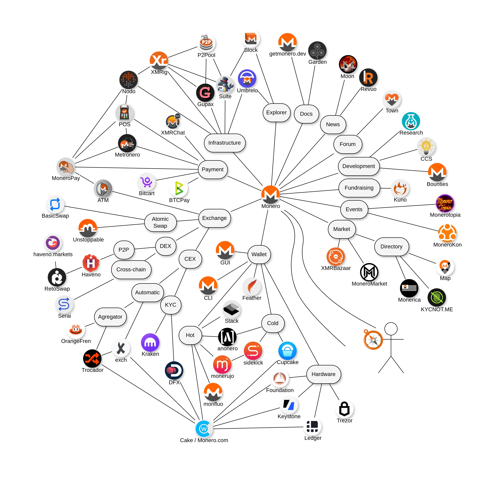

# Monero Ecosystem

The Ecosystem of Monero - [Demo](https://schmidt1024.github.io/monero-ecosystem/monero-ecosystem.html)

This idea comes to us from [mondetta](https://coracle.social/people/nprofile1qyvhwumn8ghj7un9d3shjtnddakk7um5wgh8q6twdvhszxnhwden5te0wfjkccte9enk2arpd338jtnrdakj7a33qy88wumn8ghj7mn0wvhxcmmv9uqzp2ac2ky2ms0el3cvqlpdvyvu065ys0s9vaxct6yl6yh7ymeh67uqxm0qs9). So special thanks to him for bringing this up! 🙏🏻

By mondetta a beer!
👇
48Xx3o37UzJNeQNJke46uRUxvpjHsaYHR6ERRpeuVizdJAwkUErdgbb9rWw1UdDTjoTSB4enL2hCY1b7fv52FxDPCW9Wzhw

## Purpose of the project
This map or graph of Monero Ecosystem aims to provide a visual overview, with web links to relevant projects.

The main target audience are new Monero users. Therefore only most relevant projects can compete to be added to the graph to avoid visual complexity.

## How to Contribute

We welcome contributions to the Monero Ecosystem project!

**1. Adding a new project to the graph:**

First check [Purpose of project](#purpose-of-the-project) above 👆

Then make sure the project you wish to add has most of the following properties:

- Open-source
- Popular
- Modular
- Decentralized
- Trusted by the community
- Increases Monero adoption

**2. Few ways you can contribute:**

1. Submit Ideas or Comments:
   - If you have suggestions or ideas but do not want to make changes yourself, you can add a comment or idea in the Issues section of the repository.
   - Navigate to the Issues tab and create a new issue with your suggestion or feedback.
2. Modify the Diagram:
   - Download the `.drawio` file from the repository.
   - Go to [draw.io](https://app.diagrams.net/).
   - Open the existing diagram by uploading the `.drawio` file.
   - Make your changes and save the updated file.
   - Create a pull request with your changes.

We appreciate your contributions and look forward to collaborating with you!